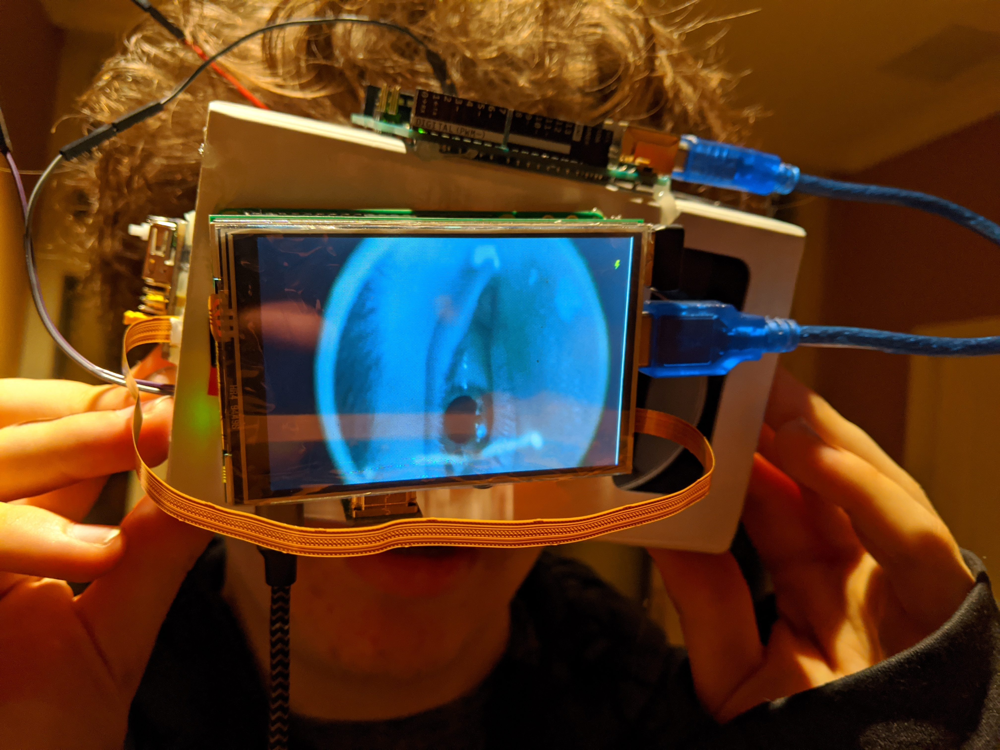

# Bismarck
Democratizing gaze-tracking technology with an open source, cheap alternative to the big-name brands.
## Problem statement
In my sophomore year, I was fascinated with the prospects of inferring the states of patients' midns using patterns in their eye movement. This was an idea that came to me spontaneously, and, upon doing more research on prior art, it appeared that this technique had already been successfully employed to recategorize syndromes on the autistic spectrum more precisely and predict neurological diseases like Alzhimer's before patients became symptomatic. I was interested in using this approach of collecting massive amounts of gaze-data in controled experiments to develop a gaze-model for attention disorders in high school students. I quickly realized, however, that every tool available off the shelf for gaze-tracking to this end was over $1000, and this was not a price I could accomodate given the small scale of my research. This problem inspired me to create a cheap, equally capable goggle using off the shelf components in order to extend this field of research to smaller scale researchers or enthusiasts.
I constructed the goggles using generic google-cardboard goggles, infrared LEDs, raspberry pi near-infrared cameras, and raspberry pi's to illuminate the eye and capture data. I used OpenCV to track the iris in realtime, and I wrote a react-native application to display split-screen video. 

## To run
Please run `python eye_motion_tracking_fixed.py` for latest gaze-tracking script
Please run `cd Bismarck/ && npx react-native start && npx react-native run-android` for RN interface
